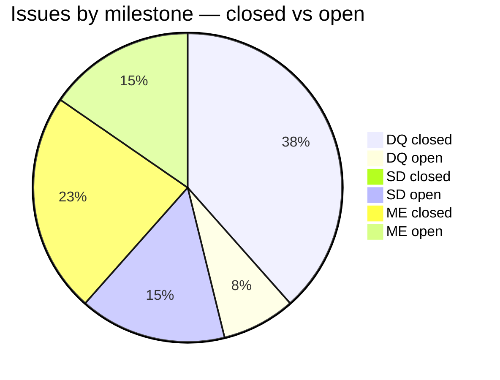
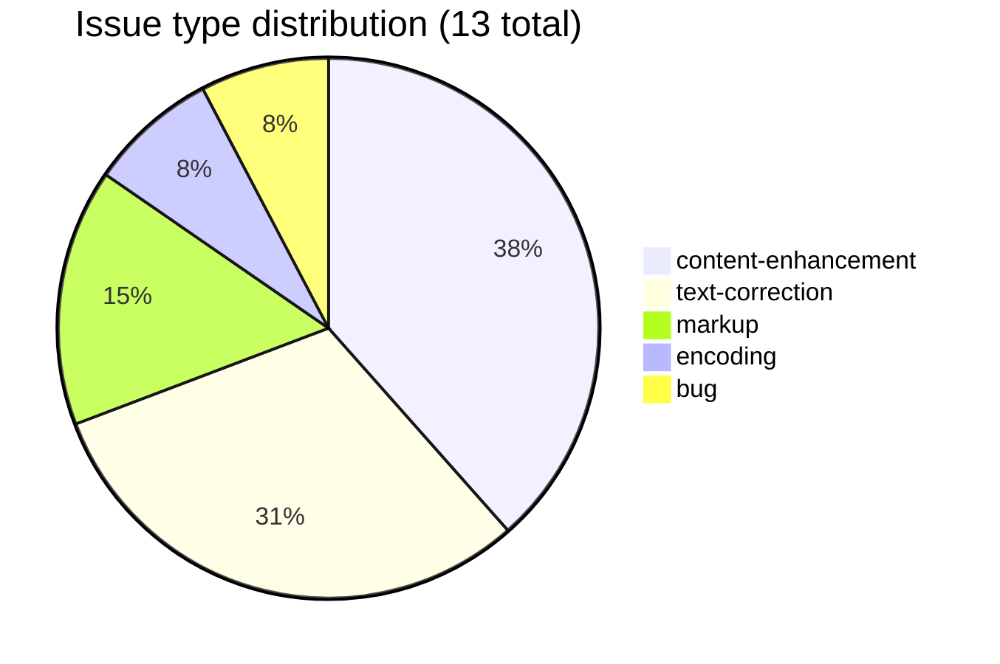

# MD — Macdonell's Sanskrit-English Dictionary

Research and correction work on the **Macdonell Sanskrit-English Dictionary**, part of the [sanskrit-lexicon](https://github.com/sanskrit-lexicon) project.

The upstream dictionary lives at [csl-orig/v02/md/md.txt](https://github.com/sanskrit-lexicon/csl-orig). This repo contains scripts and issue-by-issue workflows to clean and enhance it.

## Contents

| Directory | Description |
|---|---|
| `verbs01/` | Verb identification and correspondence with MW dictionary |
| `deva_iast_comp/` | Devanagari-to-IAST comparison pipeline (steps 0–2b) |
| `mdissues/` | Per-issue correction workflows (`issueNNN/` pattern) |

## Timeline

| Period | Work |
|---|---|
| 2020 | Verb identification (`verbs01/`): MD roots mapped to MW spellings and upasargas identified |
| 2020 | Page-column error corrections, IAST encoding fixes (`deva_iast_comp/`) |
| 2020 | English text corrections (`mdissues/issue13/`) |
| 2021 | Homonym correction in metalines (`mdissues/issue10/`) |
| 2022–2025 | Abbreviation tooltips pipeline (`mdissues/issue11/`); subheadword work (`mdissues/issue12/`) |

## Projects & Milestones

| Milestone | Project | Total | Open | Closed |
|---|---|---|---|---|
| Dictionary to Book (1) | Project 1 | 0 | 0 | 0 |
| Digitization Quality (2) | Project 2 | 6 | 1 | 5 |
| Structured Data (3) | Project 3 | 2 | 2 | 0 |
| Major Enhancements (4) | Project 4 | 5 | 2 | 3 |
| **Total** | | **13** | **5** | **8** |

## Issue Typology

### Solved (8 closed)

| # | Type | Severity | Summary |
|---|---|---|---|
| #2 | content-enhancement | minor | Python installation guide for contributor |
| #4 | content-enhancement | minor | Deva-IAST comparison pipeline step 1 |
| #6 | content-enhancement | minor | Deva-IAST comparison pipeline step 2 |
| #7 | text-correction | minor | Page-column (`pc`) errors in md.txt |
| #8 | text-correction | minor | IAST-related corrections batch |
| #9 | text-correction | minor | Italicized page errors in md.txt |
| #10 | bug | minor | Homonym identifiers missing from display lines |
| #13 | text-correction | minor | English errors 2020 batch |

### Open (5 open)

| # | Type | Severity | Summary |
|---|---|---|---|
| #1 | content-enhancement | medium | `verbs01`: identify verbs and map to MW |
| #3 | content-enhancement | minor | Deva-IAST comparison pipeline step 0 |
| #5 | encoding | minor | SLP1-IAST for ळ, ळ्ह, ँ and hiatus characters |
| #11 | markup | medium | Abbreviation tooltips |
| #12 | markup | hard | MD subheadwords — MW-style version |

## Labels

**Type** (one per issue): `link-target` · `link-splitting` · `markup` · `text-correction` · `content-enhancement` · `encoding` · `scan-quality` · `bug` · `question`

**Severity** (one per issue): `minor` · `medium` · `hard`

## Contributors

[sanskrit-lexicon](https://github.com/sanskrit-lexicon) project. See git log for individual contributions.
