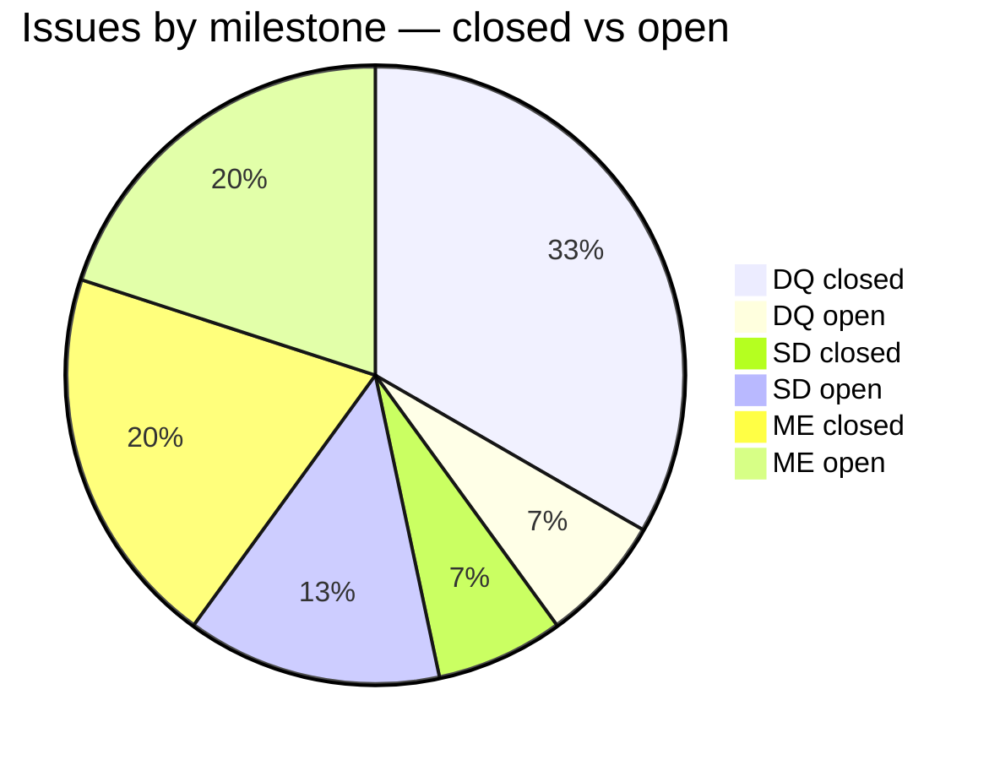
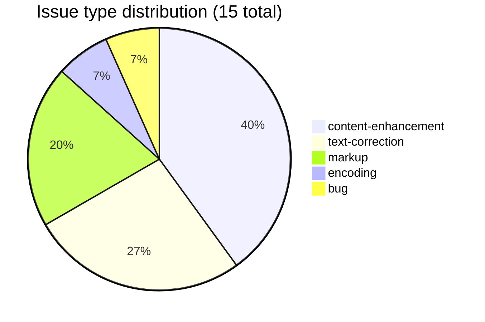

# MD — Macdonell's Sanskrit-English Dictionary

_Created: 17-04-2020 · Last updated: 11-07-2026_

Research and correction work on the **Macdonell Sanskrit-English Dictionary** (Arthur A. Macdonell, *A Sanskrit-English Dictionary, Being a Practical Handbook*, London, 1893), part of the [sanskrit-lexicon](https://github.com/sanskrit-lexicon) project.

The upstream dictionary lives at [csl-orig/v02/md/md.txt](https://github.com/sanskrit-lexicon/csl-orig/blob/main/v02/md/md.txt). This repo contains scripts and issue-by-issue workflows to clean and enhance it.

- **Landing page:** [sanskrit-lexicon.github.io/MD](https://sanskrit-lexicon.github.io/MD/) (GitHub Pages, source [index.html](https://github.com/sanskrit-lexicon/MD/blob/main/index.html))

## Front matter (`prefaces/`)

Faithful OCR + Russian translation of the dictionary's **front matter** (title, dedication to F. Max Müller, and the seven-page Preface plus the Alphabet + List of Abbreviations) from the Cologne scans. Source language is **English**, so the base per-page `.md` is the English edition and each page also has a `.ru.md`.

- Cologne source: [mdpref.html](https://sanskrit-lexicon.uni-koeln.de/scans/csldev/csldoc/build/dictionaries/prefaces/mdpref.html)
- Consolidated editions: [prefaces/mdpref_all.en.md](https://github.com/sanskrit-lexicon/MD/blob/main/prefaces/mdpref_all.en.md) · [prefaces/mdpref_all.ru.md](https://github.com/sanskrit-lexicon/MD/blob/main/prefaces/mdpref_all.ru.md)
- In-folder index: [prefaces/README.md](https://github.com/sanskrit-lexicon/MD/blob/main/prefaces/README.md)
- **Status: complete** — all 10 pages (Title, Dedication, the seven-page Preface, and the Alphabet + List of Abbreviations).

> **OCR run notes (2026-06-23).** Produced by the `/cologne-preface-ocr` skill (vision OCR + translation), English source + Russian. These pages were done on the **main thread** because background OCR subagents reproducibly hit a (spurious) content-filter API error on this dictionary; the main thread is unaffected. Each preface page is dense single-column print (high-res scans, ~7 native-resolution band reads per page).

## Applying corrections

Corrections to the source dictionary are never edited into `md.txt` directly — they are expressed as change files and applied by scripts. The full 8-stage csl-orig workflow (snapshot → `updateByLine.py` → promote → generate → XML-validate → audit → commit → refresh), the change-file format, and every gotcha are documented once, canonically, in [csl-corrections/docs/correction-workflow.md](https://github.com/sanskrit-lexicon/csl-corrections/blob/main/docs/correction-workflow.md).

The real current line 8 of [`md.txt`](https://github.com/sanskrit-lexicon/csl-orig/blob/main/v02/md/md.txt) (entry 1, headword `a`) reads:

```
{#a#}¦ <hom>1.</hom> a, <ab>pn.</ab>  idam 🞄: a-tra, a-tha.
```

A change file pairs old/new lines by line number; `updateByLine.py` applies them:

```sh
python updateByLine.py md.txt change_md.txt md_corrected.txt
```

## Documentation

- [docs/PIPELINE_MANUAL.md](https://github.com/sanskrit-lexicon/MD/blob/main/docs/PIPELINE_MANUAL.md) — **operator manual**: the deva↔IAST comparison pipeline (steps 0–2b, with the generated-then-hand-reviewed change-file gate), verbs01, the per-issue correction pattern, prefaces, symptom→cause→cure.

## Contents

| Directory | Description |
|---|---|
| [`verbs01/`](https://github.com/sanskrit-lexicon/MD/tree/main/verbs01) | Verb identification and correspondence with MW dictionary |
| [`deva_iast_comp/`](https://github.com/sanskrit-lexicon/MD/tree/main/deva_iast_comp) | Devanagari-to-IAST comparison pipeline (steps 0–2b) |
| [`mdissues/`](https://github.com/sanskrit-lexicon/MD/tree/main/mdissues) | Per-issue correction workflows (`issueNNN/` pattern) |
| [`prefaces/`](https://github.com/sanskrit-lexicon/MD/tree/main/prefaces) | Front-matter OCR + Russian translation |

## Timeline

| Period | Work |
|---|---|
| 2020 | Verb identification (`verbs01/`): MD roots mapped to MW spellings and upasargas identified |
| 2020 | Page-column error corrections, IAST encoding fixes (`deva_iast_comp/`) |
| 2020 | English text corrections (`mdissues/issue13/`) |
| 2021 | Homonym correction in metalines (`mdissues/issue10/`) |
| 2022–2025 | Abbreviation tooltips pipeline (`mdissues/issue11/`); subheadword work (`mdissues/issue12/`) |
| 2026 | Front-matter OCR + RU translation (`prefaces/`); GitHub Pages landing page |

## Projects & Milestones

Live counts as of 11-07-2026 (15 issues total):

| Milestone | Open | Closed | Total |
|---|---|---|---|
| Dictionary to Book (1) | 0 | 0 | 0 |
| Digitization Quality (2) | 1 | 5 | 6 |
| Structured Data (3) | 2 | 1 | 3 |
| Major Enhancements (4) | 3 | 3 | 6 |
| **Total** | **6** | **9** | **15** |


```mermaid
pie title Issues by milestone — closed vs open
    "DQ closed" : 5
    "DQ open" : 1
    "SD closed" : 1
    "SD open" : 2
    "ME closed" : 3
    "ME open" : 3
```


```mermaid
pie title Issue type distribution (15 total)
    "content-enhancement" : 6
    "text-correction" : 4
    "markup" : 3
    "encoding" : 1
    "bug" : 1
```

## Issue Typology

### Solved (9 closed)

| # | Type | Severity | Summary |
|---|---|---|---|
| #2 | content-enhancement | minor | Python installation guide for contributor |
| #4 | content-enhancement | minor | Deva-IAST comparison pipeline step 1 |
| #6 | content-enhancement | minor | Deva-IAST comparison pipeline step 2 |
| #7 | text-correction | minor | Page-column (`pc`) errors in md.txt |
| #8 | text-correction | minor | IAST-related corrections batch |
| #9 | text-correction | minor | Italicized page errors in md.txt |
| #10 | bug | minor | Homonym identifiers missing from display lines |
| #13 | text-correction | minor | English errors 2020 batch |
| #14 | markup | minor | Minor md.txt markup oddities |

### Open (6 open)

| # | Type | Severity | Summary |
|---|---|---|---|
| #1 | content-enhancement | medium | `verbs01`: identify verbs and map to MW |
| #3 | content-enhancement | minor | Deva-IAST comparison pipeline step 0 |
| #5 | encoding | minor | SLP1-IAST for ळ, ळ्ह, ँ and hiatus characters |
| #11 | markup | medium | Abbreviation tooltips |
| #12 | markup | hard | MD subheadwords — MW-style version |
| #15 | content-enhancement | medium | docs-pass: MD documentation review |

## Labels

**Type** (one per issue): `link-target` · `link-splitting` · `markup` · `text-correction` · `content-enhancement` · `encoding` · `scan-quality` · `bug` · `question`

**Severity** (one per issue): `minor` · `medium` · `hard`

## Contributors

[sanskrit-lexicon](https://github.com/sanskrit-lexicon) project. See git log for individual contributions.

_Dr. Mārcis Gasūns_
